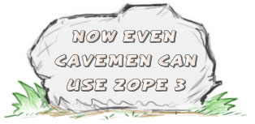
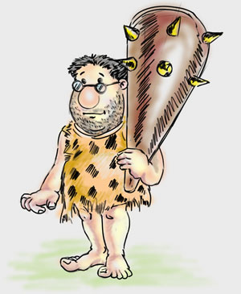

=============
What is Grok?
=============

Grok is a web application framework for Python developers. It is aimed at both
beginners and very experienced web developers. Grok has an emphasis on agile
development. Grok is easy and powerful.

You will likely have heard about many different web frameworks for Python as
well as other languages. Why should you consider Grok?

* Grok offers a *lot* of building blocks for your web application.
* Grok is informed by a *lot* of hard-earned wisdom.

Grok accomplishes this by being based on `Zope 3`_, an advanced
object-oriented web framework. While Grok is based on Zope 3, and
benefits a lot from it, you do not need to know Zope at all in order
to get productive with Grok.

`Read More <./about.html>`_

.. _Zope 3: http://wiki.zope.org/zope3

Grok News
---------
2008-01-20:
  Grok 0.11.1 has been released! See the `announcement`__ for more details!

  .. __: http://permalink.gmane.org/gmane.comp.web.zope.grok.devel/3565

2007-11-08:
  Grok 0.11 has been released! See the release `announcement`__
  for more details! For projects that want to upgrade, please read the
  `upgrade notes <upgrade.html>`_

  .. __: http://permalink.gmane.org/gmane.comp.web.zope.devel/14171

2007-10-24:
  Grok 0.10.2 has been released! See the `announcement`__ for more details!

  .. __: http://article.gmane.org/gmane.comp.web.zope.grok.devel/2786

2007-10-10:
  Grok 0.10.1 has been released! See the original `announcement`__ for more
  details!

  .. __: http://article.gmane.org/gmane.comp.web.zope.announce/1393

2007-10-05:
  Read about what was achieved during the `Grok Neanderthal Sprint`__ on the
  `Sprint Accomplishments`__ page!

  .. __: http://wiki.zope.org/grok/NeanderthalerSprint
  .. __: http://wiki.zope.org/grok/SprintAccomplishments

2007-09-24:
  The first week of October (1-5 October) we are having the `Grok Neanderthal
  Sprint`__ in Cologne, Germany. This sprint is generously sponsored by
  `GfU Cyrus`__.

  .. __: http://wiki.zope.org/grok/NeanderthalerSprint
  .. __: http://www.gfu.net

Who is Grok?
------------

Grok is a friendly caveman from the Stone Age. He has a big club that he hunts
mammoths with. He will also use this club to smash anything he doesn't like.

"ME GROK SMASH ZCML!"

The word grok comes from the novel `Stranger in a Strange Land`_ by Robert A.
Heinlein, and is defined in his book as:

  Grok means to understand so thoroughly that the observer becomes part of the
  observed - to merge, blend, intermarry, lose identity in group experience.

.. _Stranger in a Strange Land: http://en.wikipedia.org/wiki/Stranger_in_a_Strange_Land

Watch Grok in Action
--------------------

* `Simple ToDo`_ application is a tutorial-style introduction to Grok by Philipp von Weitershausen.
* `Introduction to Grok`_ is a talk given by Philipp von Weitershausen to a group of Zope developers.

.. _Simple ToDo: http://www.archive.org/details/grok_todo_part1
.. _Introduction to Grok: http://comlounge.tv/blog/zope/cltv23-snow-sprint-2007-grok-presentation

What does Grok code look like?
------------------------------

::

    import grok

    class HelloWorld(grok.Application, grok.Model):
        pass

    class Index(grok.View):
        pass

    index = grok.PageTemplate("""
        <html><body>
            
ME GROK HELLO WORLD!

        </body></html>
        """")

* `Herd of Mammoths`_: a very simple application that only goes a bit beyond "hello world".
* `Grokstar`_: a simple blog application written with Grok.
* `Grok Wiki`_: a simple wiki application written with Grok.
* `Paleosoft.org`_: a collection of sample apps written in Grok/Zope3 by
  Luciano Ramalho as part of the Google Summer of Code.

.. _Herd of Mammoths: http://www.z3lab.org/sections/blogs/philipp-weitershausen/2007_01_09_you-thought-zope-3-wasn
.. _Grokstar: http://svn.zope.org/Grokstar/
.. _Grok Wiki: http://svn.zope.org/grok/trunk/grokwiki/
.. _Paleosoft.org: http://paleosoft.org/

ME GROK HYPERLINKS!
-------------------

* Get the latest version in the form of a `Grok Python Package`_ from the Python Cheese Shop.
* Feature requests and bugs are tracked in the `Grok Issue Tracker`_ at LaunchPad.
* `Grok-dev mailing list`_ for discussing the development of Grok.
* There is a `Grok IRC`_ channel on `freenode.net`_

.. _Grok Python Package: http://cheeseshop.python.org/pypi/grok
.. _Grok Issue Tracker: https://launchpad.net/grok
.. _Grok-dev mailing list: http://mail.zope.org/mailman/listinfo/grok-dev
.. _Grok IRC: irc://irc.freenode.net/grok
.. _freenode.net: http://freenode.net/

The source code to Grok is kept in the Zope SVN repository. You can do an
anonymous check out of the latest version of Grok with the following command:::

  svn co svn://svn.zope.org/repos/main/grok/trunk grok

ME GROK TUTORIAL!
------------------

* `Grok tutorial`__

  .. __: tutorial.html

ME GROK SPRINTS AND BLOGS!
--------------------------

Grok development is often done in the form of sprints. A sprint is a when a
group of developers get together in the same place and all work on a focused
set of tasks.

* People `blogged <http://wiki.zope.org/grok/SprintAccomplishments>`_ about
  the `Grok Neanderthal Sprint <http://wiki.zope.org/grok/NeanderthalerSprint/>`_.

* `Jan-Wijbrand Kolman blogged`_ about the second Grok sprint, and
  `Martijn Faassen blogged`_ about it as well.

* `Martijn Faassen's blog entry`_ details the first Grok sprint.

.. _Martijn Faassen's blog entry: http://faassen.n--tree.net/blog/view/weblog/2006/11/09/0
.. _Jan-Wijbrand Kolman blogged: http://jw.n--tree.net/blog/dev/python/second-grok-sprint
.. _Martijn Faassen blogged: http://faassen.n--tree.net/blog/view/weblog/2007/01/09/0

.. toctree::

   about.rst
   contents.rst
   grok_overview.rst
   reference/index.rst

   bugs.rst
   README.rst
   license.rst
   copyright.rst
